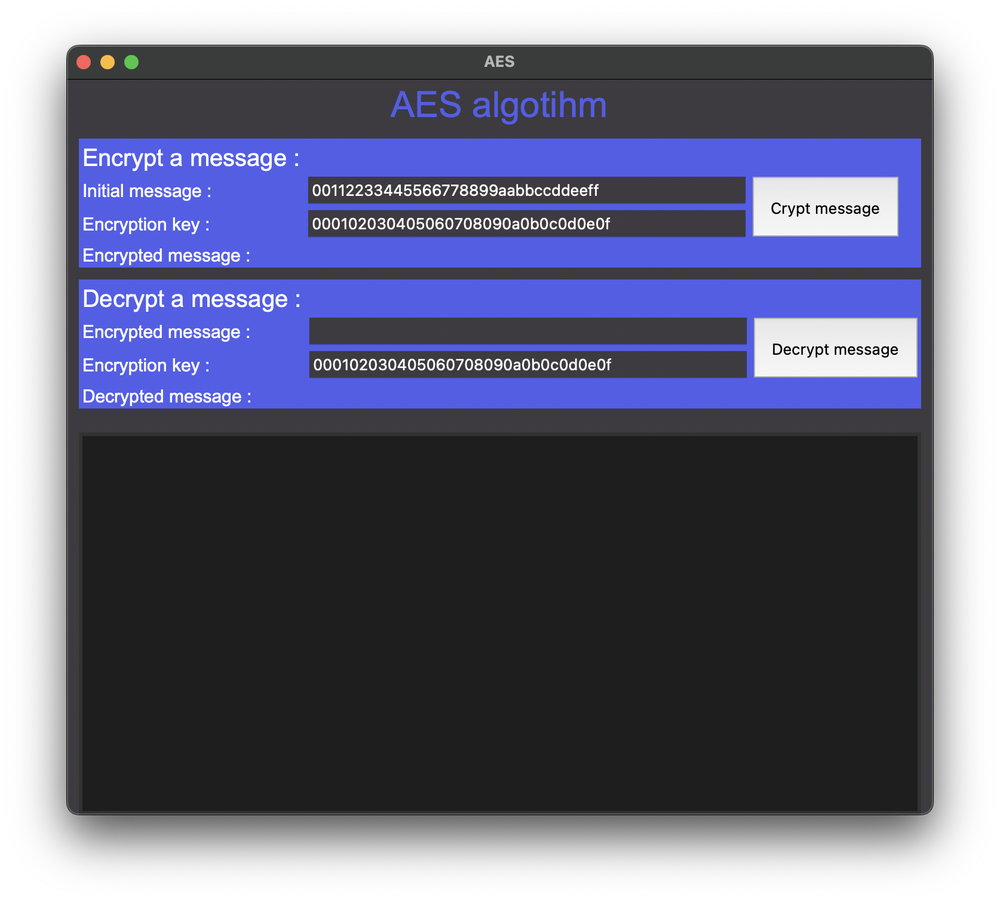
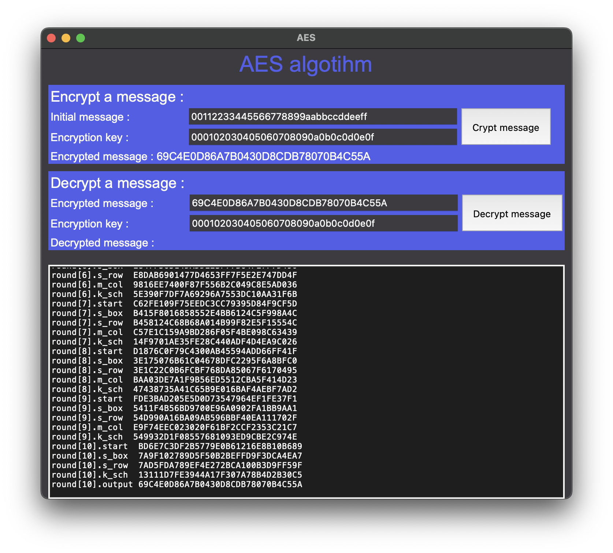
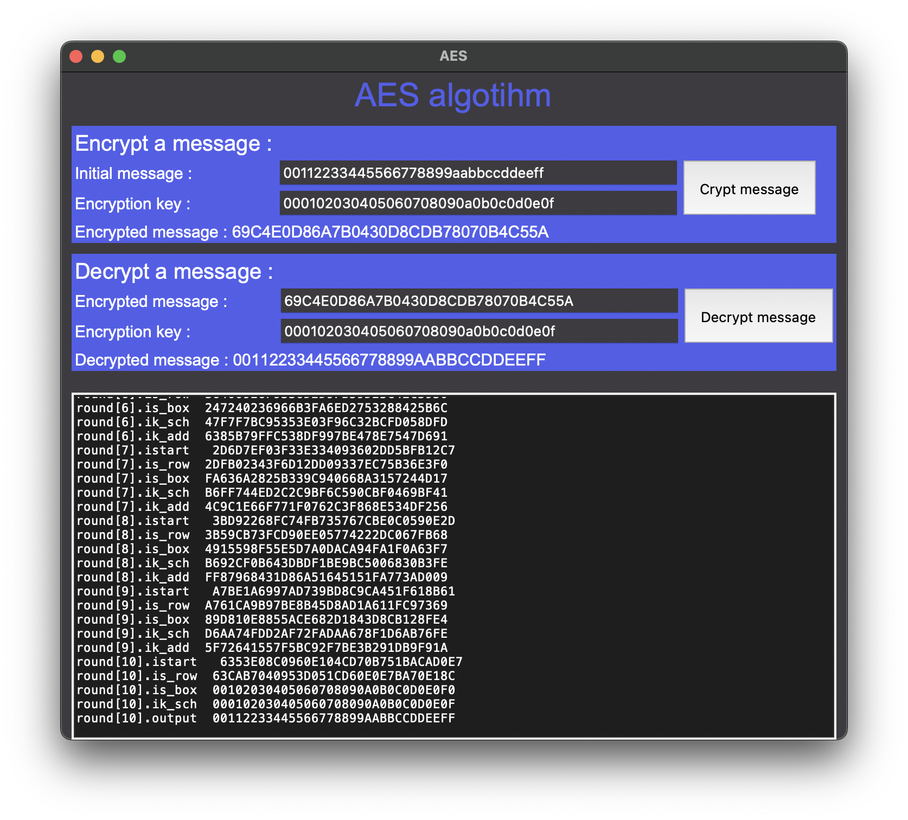

# AES
AES symmetric encryption and decryption


## 1# - Contents
1. [Project 0bjective](#2---project-objective)
2. [Retrieving and Executing the Project](#3---retrieving-and-executing-project)
    - [Clone the repository](#31---clone-the-repository)
    - [Running the Python Script](#32---running-the-python-script)
        - [Using and IDE](#321---using-an-ide)
        - [Using command Line](#322---using-command-line)
    - [Using Executable (.exe)](#33---using-executable-exe)
    - [Additional Notes](#34---additional-notes)
3. [Project Architectrue](#4---project-architecture)
4. [Pseudo-code](#5---pseudo-code)
    - [Encrypte Message with AES](#51---encrypte-message-with-aes)
    - [Decrypte Encrypte Message with AES](#52---decrypte-encrypted-message-with-aes)
6. [Functions](#6---functions)
7. [Unit Tests](#7---unit-tests)
8. [Utile Functions](#8---utile-functions)
    - [String to Matrix](#71---string-to-matrix)
    - [Print state](#72---print-state)
9. [Genral Functions - Encryption](#8---general-functions---encryption)
    - [Add Round Key](#81---add-round-key)
    - [Sub Bytes](#82---sub-bytes)
    - [Shift Rows](#83---shift-rows)
    - [Mix Columns](#84---mix-columns)
    - [Key Extension](#85---key-extension)
10. [Run Encryption](#9---run-encryption)
11. [Config](#10---config)
    - [S_BOX](#101---s_box)
    - [Mix](#102---mix)
12. [Encrypt Results](#11---encrypt-results)
13. [General Fucntion - Decryption](#21---general-functions---decryption)
    - [Inverse Shift Rows](#121---inverse-shift-rows)
    - [Inverse Sub Bytes](#122---inverse-sub-bytes)
14. [Run Decryption](#13---run-decryption)
15. [Decrypt Results](#14---decrypt-results)
16. [GUI - .exe](#15---gui---exe)
    - [Crypt a message](#151---crypt-a-message)
    - [Decrypt a message](#14---decrypt-results)

## 2# - Project Objective

1. Develop a Python code using AES algorithm to run:
    >
    > 1.1. Encrypte a message.
    >
    > 1.2. Decrypte a message.

## 3# - Retrieving and Executing Project

### 3.1# - Clone the Repository
1. Clone the repository to your local machine:
    ```bash
    git clone https://github.com/pelleservan/AES.git
    ```

### 3.2# - Running the Python Script
#### 3.2.1# - Using an IDE
1. Open your preferred Python IDE.
2. Navigate to the directory where you cloned the repository.
3. Open the Python script file `main.py` in the IDE.
4. Run the script within the IDE's environment.

#### 3.2.2# - Using Command Line
1. Navigate to the directory where you cloned the repository.
2. Run the Python script using the command:
    ```bash
    python main.py
    ```

### 3.3# - Using Executable (.exe)
1. We provided an executable (.exe) :
   - Download the .exe file from the repository.
   - Double click on the .exe file to execute it.

### 3.4# - Additional Notes
- Ensure you have the necessary dependencies installed. You may need to run `pip install -r requirements.txt` if a requirements file is provided.
- Make sure you're using a compatible version of Python as specified in the project's documentation.

## 4# - Project Architecture (à revoir)
```plaintext
AES/
├── README.md
├── requirements.txt
└── src
    ├── config.py
    ├── cypher
    │   ├── add_round_key.py
    │   ├── cypher.py
    │   ├── key_extension.py
    │   └── sub_bytes.py
    ├── interface
    │   └── window.py
    ├── main.py
    ├── operations
    │   ├── mix_columns.py
    │   ├── shift_rows.py
    │   └── utile.py
    └── tests
        └── test_operations.py
```

## 5# - Pseudo-code

To help us develop our project, we've provided the pseudo-code for the Cypher and InvCyper functions, which can be used to encrypt and decrypt messages respectively.

### 5.1# - Encrypte Message with AES
```plaintext
Cipher(byte in[4*Nb], byte out[4*Nb], word w[Nb*(Nr+1)])
begin
    byte state[4,Nb]
    state = in
    AddRoundKey(state, w[0, Nb-1]) 

    for round = 1 step 1 to Nr–1
        SubBytes(state)              
        ShiftRows(state)             
        MixColumns(state)           
        AddRoundKey(state, w[round*Nb, (round+1)*Nb-1])
    end for

    SubBytes(state)
    ShiftRows(state)
    AddRoundKey(state, w[Nr*Nb, (Nr+1)*Nb-1])
    out = state
end
```

### 5.2# - Decrypte Encrypted Message with AES
```plaintext
InvCipher(byte in[4*Nb], byte out[4*Nb], word w[Nb*(Nr+1)])
begin
    byte state[4,Nb]
    state = in
    AddRoundKey(state, w[Nr*Nb, (Nr+1)*Nb-1]) 

    for round = Nr-1 step -1 downto 1
        InvShiftRows(state)             
        InvSubBytes(state)              
        AddRoundKey(state, w[round*Nb, (round+1)*Nb-1])
        InvMixColumns(state)           
    end for

    InvShiftRows(state)
    InvSubBytes(state)
    AddRoundKey(state, w[0, Nb-1])
    out = state
end
```

## 6# - Functions
To encrypte and decrypte message with AES we will develop two functions :
1. Cypher.
2. Inverse Cypher.

To use this function we will need to develop some others :
1. Add round key.
2. Key extension.
3. Sub bytes.
4. Mix columns.
5. Shift rows.

## 7# - Unit tests

To facilitate development and code reliability, I developed unit tests for each of the functions that would be developed and used in the project.

```python
class TestAddRoundKey(unittest.TestCase):

    def test_str_to_matrix(self):
        """str_to_matrix function test."""
        result = str_to_matrix(str=str_msg)
        for i in range(len(result)):
            for j in range(len(result[i])):
                self.assertEqual(result[i, j], matrix_msg[i][j])

    def test_sub_bytes(self):
        """sub_bytes function test."""
        result = sub_bytes(state=sub_bytes_input)
        for i in range(len(result)):
            for j in range(len(result[i])):
                self.assertEqual(result[i, j], sub_bytes_output[i][j])

    def test_shift_rows(self):
        """shift_rows function test."""
        result = shift_rows(state=shift_rows_input)
        for i in range(len(result)):
            for j in range(len(result[i])):
                self.assertEqual(result[i, j], shift_rows_output[i][j])

    def test_mix_column(self):
        """mix_column function test."""
        result = mix_column(state=mix_column_input, mix=mix)
        for i in range(len(result)):
            for j in range(len(result[i])):
                self.assertEqual(result[i, j], mix_column_output[i][j])

    def test_add_round_key(self):
        """add_roundKey function test."""
        result = add_round_key(state=add_round_key_input, key=key)
        for i in range(len(result)):
            for j in range(len(result[i])):
                self.assertEqual(result[i, j], add_round_key_output[i][j])

    def test_inverse_mix_column(self):
        """inverse_mix_column function test."""
        result = mix_column(state=inverse_mix_column_input, mix=imix)
        for i in range(len(result)):
            for j in range(len(result[i])):
                self.assertEqual(result[i,j], inverse_mix_column_output[i][j])

    def test_inverse_shift_rows(self):
        """inverse_shift_rows function test."""
        result = inverse_shift_rows(state=inverse_shift_rows_input)
        for i in range(len(result)):
            for j in range(len(result[i])):
                self.assertEqual(result[i,j], inverse_shift_rows_output[i][j])

    def test_inverse_sub_bytes(self):
        """inverse_sub_bytes function test."""
        result = inverse_sub_bytes(state=inverse_sub_bytes_input)
        for i in range(len(result)):
            for j in range(len(result[i])):
                self.assertEqual(result[i,j], inverse_sub_bytes_output[i][j])

    def test_cypher(self):
        """cypher function test."""
        result = cypher(nb_round=10, initial_msg=initial_msg, chifrement_key=chifrement_key, mix=mix)[0].lower()
        self.assertEqual(result, crypted_msg)

    def test_inverse_cypher(self):
        """inverse_cypher function test."""
        result = inverse_cypher(nb_round=10, crypted_msg=cypher_output[0], keys=cypher_output[1], imix=imix).lower()
        self.assertEqual(result, initial_msg)

if __name__ =='__main__':
    unittest.main()
```

## 8# - Utile Functions

Before start to develop the above-mentioned functions we need to develop some utile functions.

### 7.1# - String To Matrix

In this project we will work with matrix. But the input is given as a string. So, we need to convert it into a matrix.

```python
def str_to_matrix(str=''):
    split_str = []

    for i in range(0, len(str)-1, 2):
        pair = str[i:i+2] 
        split_str.append(pair)
        
    matrix_size  = int(m.sqrt(len(str)/2))

    state = np.empty((matrix_size, matrix_size), dtype='U4')

    cpt = 0
    for i in range(matrix_size):
        for j in range(matrix_size):
            state[j][i] = split_str[cpt]
            cpt += 1

    return state
```

### 7.2# - Print State

To follow the status of our encryption we will develop a function which convert matrix to a printabel string.

```python
def print_state(state=np.empty((1, 1), dtype='U4'), rpl=''):

    print_state = ''

    for i in range(state.shape[0]):
        for j in range(state.shape[1]):
            print_state += str(state[j][i])

    print_state = print_state.replace(rpl, '')

    return print_state
```

## 8# - General Functions - Encryption

### 8.1# - Add Round Key

```python
def add_round_key(state=np.empty((1, 1), dtype='U4'), key=np.empty((1, 1), dtype='U4')):

    for i in range(state.shape[0]):
        for j in range(state.shape[1]):
            key_baud = bin(int(key[i][j], 16)).replace('0b', '').zfill(8)
            key_baud = key_baud.zfill(8)

            state_baud = bin(int(state[i][j], 16)).replace('0b', '')
            state_baud = state_baud.zfill(8)

            out_baud = ''

            for bit_i in range(len(state_baud)):
                out_baud += str((int(state_baud[bit_i])+int(key_baud[bit_i]))%2)

            state[i][j] = '0X' + hex(int(out_baud, 2))[2:].zfill(2).upper()

    return state
```

### 8.2# - Sub Bytes

```python
def sub_bytes(state=np.empty((1, 1), dtype='U4')) :

    for i in range(state.shape[0]):
        for j in range(state.shape[1]):
            coord = [0, 0]
            current = state[i][j]
            if '0X' in current:
                current = current[2:]
            for k in range(2):
                if current[k].isalpha():
                    coord[k] = ord(current[k])-55
                else:
                    coord[k] = int(current[k])
            state[i][j] = s_boX[coord[0]][coord[1]]
            
    return state
```

### 8.3# - Shift Rows

```python
def shift_rows(state=np.empty((1, 1), dtype='U4')):

    shifted_state = np.empty(state.shape, dtype='U4')

    for i in range(state.shape[0]):
        for j in range(state.shape[1]):
            shifted_state[i][j%state.shape[0]-i] = state[i][j]

    return shifted_state
```

### 8.4# - Mix Column

```python
def galois_multiply(a, b):
    a_int = int(a, 16)  
    b_int = int(b, 16)  
    result = 0          
    while b_int:
        if b_int & 1:
            result ^= a_int
        a_int <<= 1
        if a_int & 0x100:
            a_int ^= 0x11B
        b_int >>= 1
    return hex(result)

def mix_column(state=np.empty((1, 1), dtype='U4'), mix=np.empty((1, 1), dtype='U4')):

    result = np.empty_like(mix, dtype='U4')
    for i in range(4):
        for j in range(4):
            temp = 0
            for k in range(4):
                temp ^= int(galois_multiply(mix[i][k], state[k][j]), 16)
            result[i][j] = '0X{:02X}'.format(temp)

    return result
```

### 8.5Key Extension

```python
def rot_word(w=[]):
    
    first_element = w[0]
    
    w_without_first = w[1:]
    
    w_with_first_at_end = np.append(w_without_first, first_element)

    return w_with_first_at_end

def sub_word(w=''):

    for i in range(len(w)):
        coord = [0, 0]
        current = w[i]
        for k in range(2):
            if current[k].isalpha():
                coord[k] = ord(current[k])-55
            else:
                coord[k] = int(current[k])
        w[i] = s_box[coord[0]][coord[1]]

    return w

def round_constant(w=[], round=0):
    r = ['01', '02', '04', '08', '10', '20', '40', '80', '1B', '36']
    R = [f'{r[round]}', '00', '00', '00'] 

    R_bin = []
    for i in  range(len(R)):
        R_bin.append(bin(int(R[i], 16)).replace('0b', '').zfill(8))

    word_bin = []
    for i in range(len(w)):
        word_bin.append(bin(int(w[i], 16)).replace('0b', '').zfill(8))

    w = []
    for i in range(len(word_bin)):
        w.append('')
        for j in range(len(word_bin[i])):
            w[i] += str((int(word_bin[i][j]) + int(R_bin[i][j]))%2)
    
    for i in range(len(w)):
        w[i] = hex(int(w[i], 2))[2:].zfill(2).upper()

    return w

def g_func(w3='', round=0):

    w3 = rot_word(w=w3)

    w3 = sub_word(w=w3)

    w3 = round_constant(w=w3, round=round)

    return w3

def XOR(w1=[], w2=[]):

    exit_w = []

    w1_bin = []
    w2_bin = []
    for i in range(len(w1)):
        w1_bin.append(bin(int(w1[i], 16)).replace('0b', '').zfill(8))
        w2_bin.append(bin(int(w2[i], 16)).replace('0b', '').zfill(8))

    exit_w = []
    for i in range(len(w1_bin)):
        exit_w.append('')
        for j in range(len(w1_bin[i])):
            exit_w[i] += str((int(w1_bin[i][j]) + int(w2_bin[i][j])) % 2)

    for i in range(len(exit_w)):
        exit_w[i] = hex(int(exit_w[i], 2)).upper().replace('0X', '').zfill(2)

    return exit_w

def key_extension(key=np.empty((1, 1), dtype='U4'), round=0):

    exit_key = np.empty(key.shape, dtype='U4')

    for j in range(key.shape[1]):

        word = key[:, j]

        if j == 0:

            w = g_func(w3=key[:, -1].copy(), round=round)
        
        else:
            w = exit_key[:, j-1]

        word = XOR(w1=word, w2=w)

        exit_key[:, j] = word

    return exit_key
```

## 9# - Run Encryption

```python
def cypher(nb_round=0, initial_msg='', chifrement_key='', mix=np.empty((1, 1), dtype='U4')):

    initial_msg = initial_msg.upper()
    chifrement_key = chifrement_key.upper()

    print('CYPHER (ENCRYPT) :')

    state = str_to_matrix(initial_msg)
    print(f'round[{0}].inout\t\t{print_state(state=state, rpl='0X')}')

    matrix_key = str_to_matrix(chifrement_key)
    print(f'round[{0}].k_sch\t\t{print_state(state=matrix_key, rpl='0X')}')

    keys = [matrix_key.copy()]

    for i in range(nb_round-1):

        state = add_round_key(state=state, key=matrix_key)
        print(f'round[{i+1}].start\t\t{print_state(state=state, rpl='0X')}')
        
        state = sub_bytes(state=state)
        print(f'round[{i+1}].s_box\t\t{print_state(state=state, rpl='0X')}')

        state = shift_rows(state=state)
        print(f'round[{i+1}].s_row\t\t{print_state(state=state, rpl='0X')}')

        state = mix_column(state=state, mix=mix)
        print(f'round[{i+1}].m_col\t\t{print_state(state=state, rpl='0X')}')

        matrix_key = key_extension(key=matrix_key, round=i)
        keys.append(matrix_key)
        print(f'round[{i+1}].k_sch\t\t{print_state(state=matrix_key, rpl='')}')

    state = add_round_key(state=state, key=matrix_key)
    print(f'round[{i+2}].start\t\t{print_state(state=state, rpl='0X')}')

    state = sub_bytes(state=state)
    print(f'round[{i+2}].s_box\t\t{print_state(state=state, rpl='0X')}')

    state = shift_rows(state=state)
    print(f'round[{i+2}].s_row\t\t{print_state(state=state, rpl='0X')}')

    matrix_key = key_extension(key=matrix_key, round=i+1)
    keys.append(matrix_key)
    print(f'round[{i+2}].k_sch\t\t{print_state(state=matrix_key, rpl='')}')

    state = add_round_key(state=state, key=matrix_key)
    print(f'round[{i+2}].output\t{print_state(state=state, rpl='0X')}')

    state = print_state(state=state, rpl='0X')
    matrix_key = print_state(state=matrix_key, rpl='')

    return state, keys
```

## 10# - Config

To run the previous functions we need de define some deneral data in the module file.

### 10.1# - S_BOX

```python
s_boX = [
    ['0X63', '0X7C', '0X77', '0X7B', '0XF2', '0X6B', '0X6F', '0XC5', '0X30', '0X01', '0X67', '0X2B', '0XFE', '0XD7', '0XAB', '0X76'],
    ['0XCA', '0X82', '0XC9', '0X7D', '0XFA', '0X59', '0X47', '0XF0', '0XAD', '0XD4', '0XA2', '0XAF', '0X9C', '0XA4', '0X72', '0XC0'],
    ['0XB7', '0XFD', '0X93', '0X26', '0X36', '0X3F', '0XF7', '0XCC', '0X34', '0XA5', '0XE5', '0XF1', '0X71', '0XD8', '0X31', '0X15'],
    ['0X04', '0XC7', '0X23', '0XC3', '0X18', '0X96', '0X05', '0X9A', '0X07', '0X12', '0X80', '0XE2', '0XEB', '0X27', '0XB2', '0X75'],
    ['0X09', '0X83', '0X2C', '0X1A', '0X1B', '0X6E', '0X5A', '0XA0', '0X52', '0X3B', '0XD6', '0XB3', '0X29', '0XE3', '0X2F', '0X84'],
    ['0X53', '0XD1', '0X00', '0XED', '0X20', '0XFC', '0XB1', '0X5B', '0X6A', '0XCB', '0XBE', '0X39', '0X4A', '0X4C', '0X58', '0XCF'],
    ['0XD0', '0XEF', '0XAA', '0XFB', '0X43', '0X4D', '0X33', '0X85', '0X45', '0XF9', '0X02', '0X7F', '0X50', '0X3C', '0X9F', '0XA8'],
    ['0X51', '0XA3', '0X40', '0X8F', '0X92', '0X9D', '0X38', '0XF5', '0XBC', '0XB6', '0XDA', '0X21', '0X10', '0XFF', '0XF3', '0XD2'],
    ['0XCD', '0X0C', '0X13', '0XEC', '0X5F', '0X97', '0X44', '0X17', '0XC4', '0XA7', '0X7E', '0X3D', '0X64', '0X5D', '0X19', '0X73'],
    ['0X60', '0X81', '0X4F', '0XDC', '0X22', '0X2A', '0X90', '0X88', '0X46', '0XEE', '0XB8', '0X14', '0XDE', '0X5E', '0X0B', '0XDB'],
    ['0XE0', '0X32', '0X3A', '0X0A', '0X49', '0X06', '0X24', '0X5C', '0XC2', '0XD3', '0XAC', '0X62', '0X91', '0X95', '0XE4', '0X79'],
    ['0XE7', '0XC8', '0X37', '0X6D', '0X8D', '0XD5', '0X4E', '0XA9', '0X6C', '0X56', '0XF4', '0XEA', '0X65', '0X7A', '0XAE', '0X08'],
    ['0XBA', '0X78', '0X25', '0X2E', '0X1C', '0XA6', '0XB4', '0XC6', '0XE8', '0XDD', '0X74', '0X1F', '0X4B', '0XBD', '0X8B', '0X8A'],
    ['0X70', '0X3E', '0XB5', '0X66', '0X48', '0X03', '0XF6', '0X0E', '0X61', '0X35', '0X57', '0XB9', '0X86', '0XC1', '0X1D', '0X9E'],
    ['0XE1', '0XF8', '0X98', '0X11', '0X69', '0XD9', '0X8E', '0X94', '0X9B', '0X1E', '0X87', '0XE9', '0XCE', '0X55', '0X28', '0XDF'],
    ['0X8C', '0XA1', '0X89', '0X0D', '0XBF', '0XE6', '0X42', '0X68', '0X41', '0X99', '0X2D', '0X0F', '0XB0', '0X54', '0XBB', '0X16 ']
]
```

### 10.2# - Mix

```python
mix = [
    ['02', '03', '01', '01'],
    ['01', '02', '03', '01'],
    ['01', '01', '02', '03'],
    ['03', '01', '01', '02']
]
```

## 11# - Encrypt Results

With the Cypher function and the folling inputs we get the following output.

1. Inputs :
    - Initial message : `00112233445566778899aabbccddeeff`.
    - Encryption key : `000102030405060708090a0b0c0d0e0f`.

2. Outputs :
```bash
CYPHER (ENCRYPT) :
round[0].inout          00112233445566778899AABBCCDDEEFF
round[0].k_sch          000102030405060708090A0B0C0D0E0F
round[1].start          00102030405060708090A0B0C0D0E0F0
round[1].s_box          63CAB7040953D051CD60E0E7BA70E18C
round[1].s_row          6353E08C0960E104CD70B751BACAD0E7
round[1].m_col          5F72641557F5BC92F7BE3B291DB9F91A
round[1].k_sch          D6AA74FDD2AF72FADAA678F1D6AB76FE
round[2].start          89D810E8855ACE682D1843D8CB128FE4
round[2].s_box          A761CA9B97BE8B45D8AD1A611FC97369
round[2].s_row          A7BE1A6997AD739BD8C9CA451F618B61
round[2].m_col          FF87968431D86A51645151FA773AD009
round[2].k_sch          B692CF0B643DBDF1BE9BC5006830B3FE
round[3].start          4915598F55E5D7A0DACA94FA1F0A63F7
round[3].s_box          3B59CB73FCD90EE05774222DC067FB68
round[3].s_row          3BD92268FC74FB735767CBE0C0590E2D
round[3].m_col          4C9C1E66F771F0762C3F868E534DF256
round[3].k_sch          B6FF744ED2C2C9BF6C590CBF0469BF41
round[4].start          FA636A2825B339C940668A3157244D17
round[4].s_box          2DFB02343F6D12DD09337EC75B36E3F0
round[4].s_row          2D6D7EF03F33E334093602DD5BFB12C7
round[4].m_col          6385B79FFC538DF997BE478E7547D691
round[4].k_sch          47F7F7BC95353E03F96C32BCFD058DFD
round[5].start          247240236966B3FA6ED2753288425B6C
round[5].s_box          36400926F9336D2D9FB59D23C42C3950
round[5].s_row          36339D50F9B539269F2C092DC4406D23
round[5].m_col          F4BCD45432E554D075F1D6C51DD03B3C
round[5].k_sch          3CAAA3E8A99F9DEB50F3AF57ADF622AA
round[6].start          C81677BC9B7AC93B25027992B0261996
round[6].s_box          E847F56514DADDE23F77B64FE7F7D490
round[6].s_row          E8DAB6901477D4653FF7F5E2E747DD4F
round[6].m_col          9816EE7400F87F556B2C049C8E5AD036
round[6].k_sch          5E390F7DF7A69296A7553DC10AA31F6B
round[7].start          C62FE109F75EEDC3CC79395D84F9CF5D
round[7].s_box          B415F8016858552E4BB6124C5F998A4C
round[7].s_row          B458124C68B68A014B99F82E5F15554C
round[7].m_col          C57E1C159A9BD286F05F4BE098C63439
round[7].k_sch          14F9701AE35FE28C440ADF4D4EA9C026
round[8].start          D1876C0F79C4300AB45594ADD66FF41F
round[8].s_box          3E175076B61C04678DFC2295F6A8BFC0
round[8].s_row          3E1C22C0B6FCBF768DA85067F6170495
round[8].m_col          BAA03DE7A1F9B56ED5512CBA5F414D23
round[8].k_sch          47438735A41C65B9E016BAF4AEBF7AD2
round[9].start          FDE3BAD205E5D0D73547964EF1FE37F1
round[9].s_box          5411F4B56BD9700E96A0902FA1BB9AA1
round[9].s_row          54D990A16BA09AB596BBF40EA111702F
round[9].m_col          E9F74EEC023020F61BF2CCF2353C21C7
round[9].k_sch          549932D1F08557681093ED9CBE2C974E
round[10].start         BD6E7C3DF2B5779E0B61216E8B10B689
round[10].s_box         7A9F102789D5F50B2BEFFD9F3DCA4EA7
round[10].s_row         7AD5FDA789EF4E272BCA100B3D9FF59F
round[10].k_sch         13111D7FE3944A17F307A78B4D2B30C5
round[10].output        69C4E0D86A7B0430D8CDB78070B4C55A
```

This exactly the same thing than we can have throw the test vectors.

## 21# - General Functions - Decryption

To run the AES Descryption we need toe develop some new functions.

### 12.1# - Inverse Shift Rows

```python
def inverse_sub_bytes(state=np.empty((1, 1), dtype='U4')) :

    for i in range(state.shape[0]):
        for j in range(state.shape[1]):
            coord = [0, 0]
            current = state[i][j]
            if '0X' in current:
                current = current[2:]
            for k in range(2):
                if current[k].isalpha():
                    coord[k] = ord(current[k])-55
                else:
                    coord[k] = int(current[k])
            state[i][j] = is_boX[coord[0]][coord[1]]
            
    return state
``` 

### 12.2# - Inverse Sub Bytes

```python
def inverse_sub_bytes(state=np.empty((1, 1), dtype='U4')) :

    for i in range(state.shape[0]):
        for j in range(state.shape[1]):
            coord = [0, 0]
            current = state[i][j]
            if '0X' in current:
                current = current[2:]
            for k in range(2):
                if current[k].isalpha():
                    coord[k] = ord(current[k])-55
                else:
                    coord[k] = int(current[k])
            state[i][j] = is_boX[coord[0]][coord[1]]
            
    return state
```

## 13# - Run Decryption

```python
def inverse_cypher(nb_round=0, crypted_msg='', keys=[], imix=np.empty((1, 1), dtype='U4')):

    print('INVERSE CYPHER (DECRYPT) :')

    state = str_to_matrix(crypted_msg)
    print(f'round[{0}].iinout\t\t\t{print_state(state=state, rpl='0X')}')

    matrix_key = keys[-1].copy()
    print(f'round[{0}].ik_sch\t\t\t{print_state(state=matrix_key, rpl='0X')}')

    state = add_round_key(state=state, key=matrix_key)
    print(f'round[{1}].istart\t\t\t{print_state(state=state, rpl='0X')}')

    for i in range(nb_round-1):

        state = inverse_shift_rows(state=state)
        print(f'round[{i+1}].is_row\t\t\t{print_state(state=state, rpl='0X')}')

        state = inverse_sub_bytes(state=state)
        print(f'round[{i+1}].is_box\t\t\t{print_state(state=state, rpl='0X')}')
        
        matrix_key = keys[-i-2].copy()
        print(f'round[{i+1}].ik_sch\t\t\t{print_state(state=matrix_key, rpl='')}')

        state = add_round_key(state=state, key=matrix_key)
        print(f'round[{i+1}].ik_add\t\t\t{print_state(state=state, rpl='0X')}')

        state = mix_column(state=state, mix=imix)
        print(f'round[{i+2}].istart \t\t{print_state(state=state, rpl='0X')}')

    state = inverse_shift_rows(state=state)
    print(f'round[{i+2}].is_row\t\t{print_state(state=state, rpl='0X')}')

    state = inverse_sub_bytes(state=state)
    print(f'round[{i+2}].is_box\t\t{print_state(state=state, rpl='0X')}')

    matrix_key = keys[0].copy()
    print(f'round[{10}].ik_sch\t\t{print_state(state=matrix_key, rpl='0X')}')

    state = add_round_key(state=state, key=matrix_key)
    print(f'round[{10}].output\t\t{print_state(state=state, rpl='0X')}')

    state = print_state(state=state, rpl='0X')

    return state
```

## 14# - Decrypt Results

With the Cypher function and the folling inputs we get the following output.

1. Inputs :
    - Initial message : `00112233445566778899aabbccddeeff`.
    - Encryption key : `000102030405060708090a0b0c0d0e0f`.

2. Outputs :
```bash
INVERSE CYPHER (DECRYPT) :
round[0].iinout                 69C4E0D86A7B0430D8CDB78070B4C55A
round[0].ik_sch                 13111D7FE3944A17F307A78B4D2B30C5
round[1].istart                 7AD5FDA789EF4E272BCA100B3D9FF59F
round[1].is_row                 7A9F102789D5F50B2BEFFD9F3DCA4EA7
round[1].is_box                 BD6E7C3DF2B5779E0B61216E8B10B689
round[1].ik_sch                 549932D1F08557681093ED9CBE2C974E
round[1].ik_add                 E9F74EEC023020F61BF2CCF2353C21C7
round[2].istart                 54D990A16BA09AB596BBF40EA111702F
round[2].is_row                 5411F4B56BD9700E96A0902FA1BB9AA1
round[2].is_box                 FDE3BAD205E5D0D73547964EF1FE37F1
round[2].ik_sch                 47438735A41C65B9E016BAF4AEBF7AD2
round[2].ik_add                 BAA03DE7A1F9B56ED5512CBA5F414D23
round[3].istart                 3E1C22C0B6FCBF768DA85067F6170495
round[3].is_row                 3E175076B61C04678DFC2295F6A8BFC0
round[3].is_box                 D1876C0F79C4300AB45594ADD66FF41F
round[3].ik_sch                 14F9701AE35FE28C440ADF4D4EA9C026
round[3].ik_add                 C57E1C159A9BD286F05F4BE098C63439
round[4].istart                 B458124C68B68A014B99F82E5F15554C
round[4].is_row                 B415F8016858552E4BB6124C5F998A4C
round[4].is_box                 C62FE109F75EEDC3CC79395D84F9CF5D
round[4].ik_sch                 5E390F7DF7A69296A7553DC10AA31F6B
round[4].ik_add                 9816EE7400F87F556B2C049C8E5AD036
round[5].istart                 E8DAB6901477D4653FF7F5E2E747DD4F
round[5].is_row                 E847F56514DADDE23F77B64FE7F7D490
round[5].is_box                 C81677BC9B7AC93B25027992B0261996
round[5].ik_sch                 3CAAA3E8A99F9DEB50F3AF57ADF622AA
round[5].ik_add                 F4BCD45432E554D075F1D6C51DD03B3C
round[6].istart                 36339D50F9B539269F2C092DC4406D23
round[6].is_row                 36400926F9336D2D9FB59D23C42C3950
round[6].is_box                 247240236966B3FA6ED2753288425B6C
round[6].ik_sch                 47F7F7BC95353E03F96C32BCFD058DFD
round[6].ik_add                 6385B79FFC538DF997BE478E7547D691
round[7].istart                 2D6D7EF03F33E334093602DD5BFB12C7
round[7].is_row                 2DFB02343F6D12DD09337EC75B36E3F0
round[7].is_box                 FA636A2825B339C940668A3157244D17
round[7].ik_sch                 B6FF744ED2C2C9BF6C590CBF0469BF41
round[7].ik_add                 4C9C1E66F771F0762C3F868E534DF256
round[8].istart                 3BD92268FC74FB735767CBE0C0590E2D
round[8].is_row                 3B59CB73FCD90EE05774222DC067FB68
round[8].is_box                 4915598F55E5D7A0DACA94FA1F0A63F7
round[8].ik_sch                 B692CF0B643DBDF1BE9BC5006830B3FE
round[8].ik_add                 FF87968431D86A51645151FA773AD009
round[9].istart                 A7BE1A6997AD739BD8C9CA451F618B61
round[9].is_row                 A761CA9B97BE8B45D8AD1A611FC97369
round[9].is_box                 89D810E8855ACE682D1843D8CB128FE4
round[9].ik_sch                 D6AA74FDD2AF72FADAA678F1D6AB76FE
round[9].ik_add                 5F72641557F5BC92F7BE3B291DB9F91A
round[10].istart                6353E08C0960E104CD70B751BACAD0E7
round[10].is_row                63CAB7040953D051CD60E0E7BA70E18C
round[10].is_box                00102030405060708090A0B0C0D0E0F0
round[10].ik_sch                000102030405060708090A0B0C0D0E0F
round[10].output                00112233445566778899AABBCCDDEEFF
```

This exactly the same thing than we can have throw the test vectors.

## 15# - GUI - .exe

To invole the userexperience I developed a GUI using tkinter.



We can find three sections :
1. __Encrypte a message__.
2. __Decrypt a message__.
3. __Shell__.

This GUI provide as exemple an :
1. __initial message__ : `00112233445566778899aabbccddeeff`
2. __encryption key__ : `000102030405060708090a0b0c0d0e0f`

### 15.1# - Crypt a message :
1. Provide an __Initail message__.
2. Provide an __Encryption key__.
3. Click on __Crypt message__.

We get the following informations :
1. The __crypted message__.
2. The __message__ and __encryption key__ evolution throw the shell.


### 15.2# - Decrypt a message :
1. Provide an __Encrypted message__.
2. Provide an __Encryption key__.
3. Click on __Decrypt message__.

we get the following informations :
1. The __decrypted key__.
2. The __message__ and the __encryption key__ evolution throw the shell.
